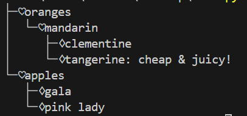

# 重构FJE
本仓库实现了使用迭代器+策略模式重构前面的FJE  
其中迭代器的实现集中于新的```ElementIterator.py```中  
策略模式则集中表现于类```TreeStyleJson```和类```RectangleStyleJson```中的```build_tree()```和```build_subtree()```方法中  
运行方式是在命令行执行如下命令：
```
python main.py -f <json file> -s <tree/rectangle> -i <none/poker/music>
```
例如执行如下命令:
```
python main.py -f test.json -s tree -i poker
```
得到如下结果：

总的来说与之前代码的变化就是多了个迭代器并转换了一下思路